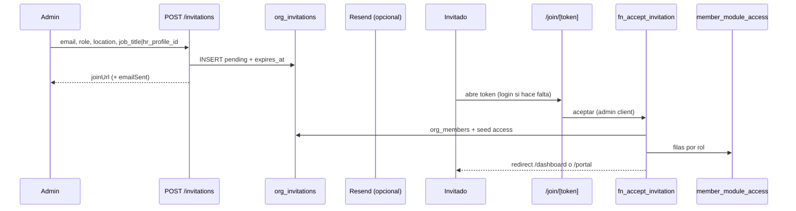
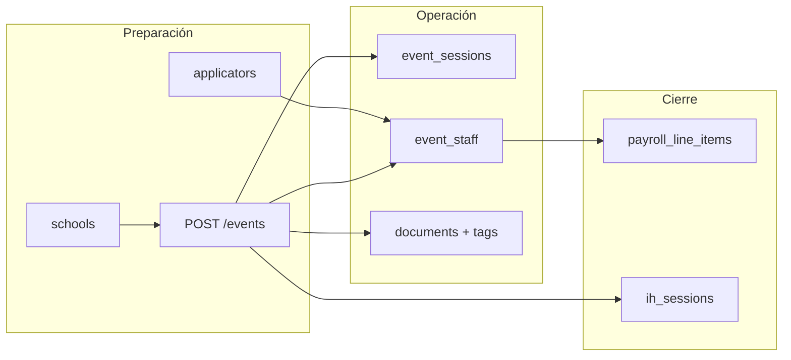
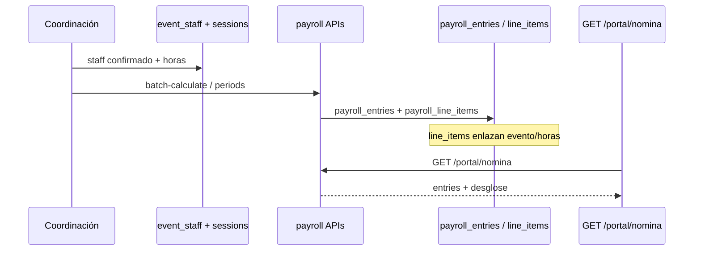
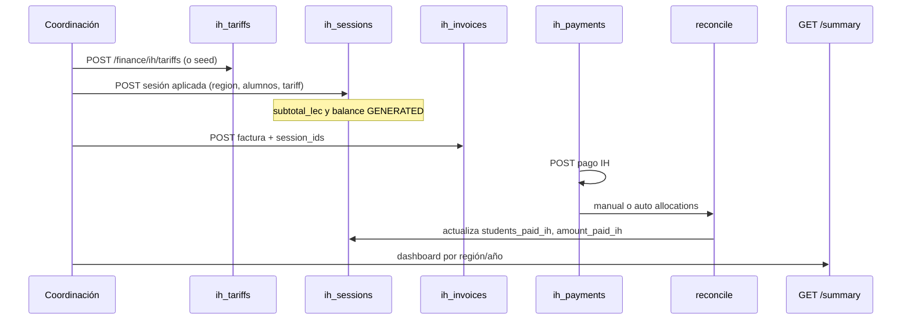
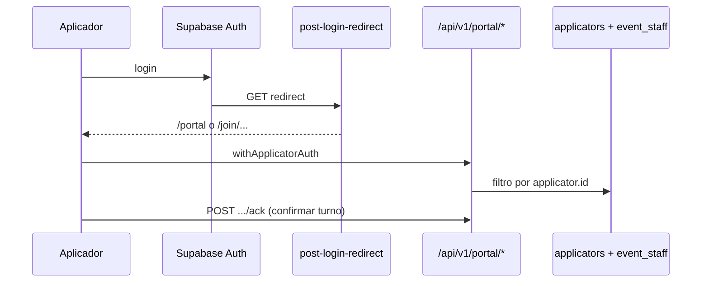
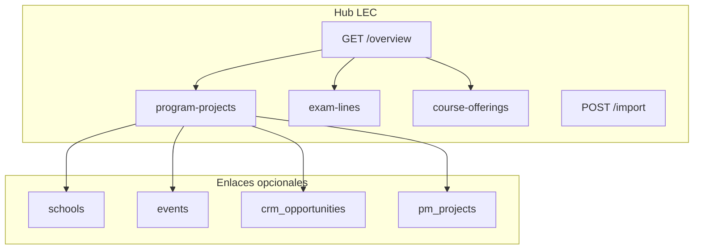
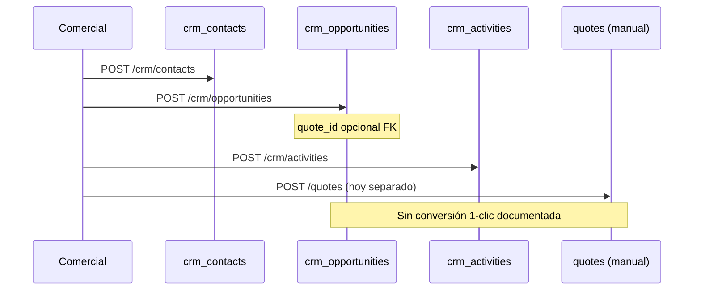

# Flujos backend E2E — LEC Orb

Documento **as-built** de los recorridos principales: quién actúa, qué APIs se llaman, qué tablas mutan y qué tan completo está el flujo. Complementa [API_MODULES.md](./API_MODULES.md) y [DATABASE_SCHEMA.md](./DATABASE_SCHEMA.md).

**Convención de estado**

| Badge | Significado |
|-------|-------------|
| 🟢 **Implementado** | UI + API + tablas en producción |
| 🟡 **Parcial** | Falta un eslabón (automatización, RLS sede, enlace UI) |
| 🔵 **Planificado** | Diseño o backlog; no confiar como operación diaria |

**Plan maestro:** [BACKEND_DOCUMENTATION_PLAN.md](./BACKEND_DOCUMENTATION_PLAN.md) (Paso 2).

---

## Índice de flujos

| ID | Flujo | Estado |
|----|-------|--------|
| [F1](#f1--invitación--alta-en-organización) | Invitación → alta en org | 🟢 |
| [F2](#f2--evento-cambridge-ciclo-operativo) | Evento Cambridge (operación) | 🟢 |
| [F3](#f3--nómina-por-evento) | Nómina por evento | 🟡 |
| [F4](#f4--ih-cxc-sesión--factura--pago) | IH CxC | 🟢 |
| [F5](#f5--portal-aplicador) | Portal aplicador | 🟢 |
| [F6](#f6--concentrado-lec-hub) | Concentrado LEC | 🟢 |
| [F7](#f7--crm-oportunidad--cotización) | CRM → cotización | 🟡 |

---

## F1 — Invitación → alta en organización

| Campo | Valor |
|-------|--------|
| **Estado** | 🟢 Implementado |
| **Actores** | Admin (emisor), usuario invitado |
| **Módulos sidebar** | Usuarios (`users`), Ajustes |
| **Última revisión** | 2026-05-15 |

### Diagrama

### Pasos

1. **Admin** abre `/dashboard/users` y crea invitación (`invite-user-dialog.tsx`).
2. **POST** `/api/v1/invitations` valida Zod → sede en `org_locations` → puesto (`job_title` o `hr_profile_id`).
3. Si `role = applicator` y se elige aplicador existente, se envía `applicator_id` (binding explícito).
4. Se inserta `org_invitations` (`status = pending`, `expires_at` default +7 días).
5. Opcional: email vía Resend; si falla, la API **sigue** devolviendo `joinUrl`.
6. Invitado visita `/join/[token]`; si no hay sesión → login/registro → vuelve al token.
7. Server Action llama **RPC** `fn_accept_invitation` (service role): crea/actualiza `org_members`, seed `member_module_access` (no-applicator), vincula aplicador si aplica.
8. **Post-login:** `GET /api/v1/auth/post-login-redirect` prioriza portal si hay perfil aplicador o invite pendiente.

### Tablas y APIs

| Paso | API / acción | Tabla(s) |
|------|----------------|----------|
| Crear | `POST /api/v1/invitations` | `org_invitations` |
| Catálogo sede | `GET /api/v1/org-locations` | `org_locations` |
| Aceptar | RPC `fn_accept_invitation` | `org_members`, `member_module_access`, `applicators` |
| Redirect | `GET /api/v1/auth/post-login-redirect` | — |

### Errores y permisos frecuentes

| Código | Causa |
|--------|--------|
| **400** | Sede no existe, falta puesto, Zod inválido (antes de comprobar admin) |
| **403** | Caller no es `admin` |
| **EXPIRED** | Token pending pero `expires_at` vencido → RPC marca `expired` |

### Enlaces

- [wiki/invitaciones-campos-y-api.md](./wiki/invitaciones-campos-y-api.md)
- [ADR-001](./adr/ADR-001-invitation-rpc.md)
- [DATABASE_SCHEMA §1, §17](./DATABASE_SCHEMA.md)

---

## F2 — Evento Cambridge (ciclo operativo)

| Campo | Valor |
|-------|--------|
| **Estado** | 🟢 Implementado (🔵 RLS por sede en listados) |
| **Actores** | Coordinación exámenes, supervisor |
| **Módulos sidebar** | Eventos, Escuelas, Aplicadores, Documentos eventos, Planeación UNOi |
| **Última revisión** | 2026-05-15 |

### Diagrama

### Pasos

1. **Escuela** registrada (`schools`) — Directorio o Coordinación.
2. **Evento** creado: `POST /api/v1/events` con estado tipo `PUBLISHED` / `COMPLETED` (mayúsculas en DB).
3. **Sesiones** y slots (`event_sessions`, slots) — planner / recalculate según módulo.
4. **Staff:** `POST /api/v1/events/[id]/staff` — aplicador, rol, `status`, `acknowledgment_status` (visibilidad nómina/portal).
5. **Documentos:** UI `/dashboard/coordinacion-examenes/documentos-eventos/[eventId]` — `GET/POST /api/v1/documents` con `record_id = eventId`, tags `event-logistics`, etc.
6. **Financiero evento:** `GET/PATCH /api/v1/events/[id]/financials` cuando aplica P&L por sesión.
7. **Derivados:** líneas en nómina (F3), sesión IH (F4), fila en concentrado LEC con `event_id` (F6).

### Tablas y APIs

| Paso | API | Tabla(s) |
|------|-----|----------|
| CRUD evento | `/api/v1/events`, `/events/[id]` | `events` |
| Staff | `/events/[id]/staff` | `event_staff` |
| Sesiones | `/events/[id]/slots`, recalculate | `event_sessions`, slots |
| Documentos | `/api/v1/documents` | `documents` + Storage |
| Finanzas | `/events/[id]/financials` | campos financieros en evento/sesión |

### Errores y permisos frecuentes

- **403** sin `events` en `member_module_access`.
- Estados en minúsculas rompen reportes y nómina — usar `COMPLETED`, `PUBLISHED`, `CONFIRMED`.
- **🔵** Operador BC aún puede ver eventos de Sonora si no hay filtro sede (ver [wiki/sedes-multisede-y-aislamiento-operativo.md](./wiki/sedes-multisede-y-aislamiento-operativo.md)).

### Enlaces

- [wiki/eventos-documentos-coordinacion.md](./wiki/eventos-documentos-coordinacion.md)
- [CAMBRIDGE_LOGISTICS_IMPORT_MATRIX.md](./CAMBRIDGE_LOGISTICS_IMPORT_MATRIX.md)

---

## F3 — Nómina por evento

| Campo | Valor |
|-------|--------|
| **Estado** | 🟡 Parcial — cálculo y portal OK; conciliación viáticos y reglas 2026 homogéneas en evolución |
| **Actores** | Coordinación (admin), aplicador (lectura portal) |
| **Módulos sidebar** | Nóminas (`payroll`), Viáticos (`travel-expenses` → alias finanzas) |
| **Última revisión** | 2026-05-15 |

### Diagrama

### Pasos

1. Eventos con **staff** en estado confirmado y horas registradas (F2).
2. Periodo de nómina: `payroll_periods` (generación sugerida vía `/api/v1/payroll/periods/generate-suggested`).
3. **Cálculo:** `/api/v1/payroll/batch-calculate` agrega entradas por aplicador/rol.
4. **Detalle obligatorio para UI:** insertar **`payroll_line_items`** por evento (`entry_id`, horas, evento) — sin esto el portal no muestra desglose.
5. Compatibilidad: columnas legacy `rate_per_hour`, `subtotal`, `total` en `payroll_entries` (NOT NULL).
6. Aplicador consulta **GET** `/api/v1/portal/nomina` (`withApplicatorAuth`).
7. Coordinación: analytics/audit/compare-excel bajo `/api/v1/payroll/*`.

### Tablas y APIs

| Paso | API | Tabla(s) |
|------|-----|----------|
| Listado | `GET /api/v1/payroll` | `payroll_entries` |
| Calcular | `POST /api/v1/payroll/batch-calculate` | `payroll_entries`, `payroll_line_items` |
| Resumen coord. | `GET /api/v1/payroll/coordination-summary` | agregados |
| Portal | `GET /api/v1/portal/nomina` | entries del aplicador |
| Viáticos | `/api/v1/finance/travel-expenses` | `travel_expense_reports` |

### Errores y permisos frecuentes

- Portal sin líneas: faltan `payroll_line_items`.
- **403** módulo `payroll` en `member_module_access`.

### Enlaces

- [API_MODULES — Payroll](./API_MODULES.md)
- `CLAUDE.md` / `AGENTS.md` — gotchas nómina

---

## F4 — IH CxC (sesión → factura → pago)

| Campo | Valor |
|-------|--------|
| **Estado** | 🟢 Implementado |
| **Actores** | Finanzas, coordinación exámenes |
| **Módulos sidebar** | CxC IH (`ih-billing` → `/coordinacion-examenes/cxc`) |
| **Última revisión** | 2026-05-15 |

### Diagrama

### Pasos

1. **Tarifas** por año y tipo examen: `ih_tariffs` (`POST /finance/ih/tariffs` o seed embebido).
2. **Sesión aplicada:** `POST /finance/ih/sessions` — `region` `SONORA` | `BAJA_CALIFORNIA`, UNIQUE por escuela+examen+fecha.
3. Import masivo opcional: `POST /finance/ih/sessions/import`.
4. **Factura:** `POST /finance/ih/invoices` — opcionalmente liga `session_ids`.
5. **Pago recibido:** `POST /finance/ih/payments` — `proof_path` en Storage.
6. **Conciliación:** `POST /finance/ih/payments/[id]/reconcile` — modo `manual` (allocations) o `auto` (sugerencia PENDING misma región).
7. Puente: `ih_payment_sessions` registra monto aplicado por sesión.
8. **Dashboard:** `GET /finance/ih/summary?year=` — ejecutado, pagado, saldo, alertas por escuela.

### Tablas y APIs

| Paso | API | Tabla(s) |
|------|-----|----------|
| Tarifas | `/finance/ih/tariffs` | `ih_tariffs` |
| Sesiones | `/finance/ih/sessions` | `ih_sessions` |
| Facturas | `/finance/ih/invoices` | `ih_invoices` |
| Pagos | `/finance/ih/payments` | `ih_payments` |
| Conciliar | `.../payments/[id]/reconcile` | `ih_payment_sessions`, update sessions |
| Resumen | `/finance/ih/summary` | lectura agregada |

### Errores y permisos frecuentes

| Código | Causa |
|--------|--------|
| **409** | Sesión duplicada (misma escuela, examen, fecha) |
| **403** | Sin permiso `finanzas` / `ih-billing` en access |

UI filtra por región (tabs Sonora/BC); **RLS no filtra por sede del operador** — 🟡.

### Enlaces

- [API_MODULES — IH Billing](./API_MODULES.md#ih-billing-cxc-cambridge)
- [DATABASE_SCHEMA §19](./DATABASE_SCHEMA.md)

---

## F5 — Portal aplicador

| Campo | Valor |
|-------|--------|
| **Estado** | 🟢 Implementado |
| **Actores** | Aplicador (rol `applicator` o perfil vinculado) |
| **Módulos** | Route group `(portal)` — sin `module_registry` del dashboard |
| **Última revisión** | 2026-05-15 |

### Diagrama

### Pasos

1. Usuario debe tener fila en **`applicators`** con `auth_user_id` (F1 o auto-link por email en post-login).
2. Tras login, redirect a **`/portal`**.
3. **GET** `/api/v1/portal/me` — perfil aplicador.
4. **Eventos asignados:** `GET /api/v1/portal/event-assignments` — staff/slots del aplicador.
5. **Confirmación:** `POST /api/v1/portal/event-assignments/[staffId]/ack`.
6. **Horarios:** `GET /api/v1/portal/horarios`.
7. **Nómina:** `GET /api/v1/portal/nomina` (F3).
8. **Métricas:** `GET /api/v1/portal/metricas`.

Invitación solo portal: flujo **`/join-portal/[token]`** + RPC `fn_accept_applicator_portal_invitation` (paralelo a org invite).

### Tablas y APIs

| Pantalla | API | Datos |
|----------|-----|-------|
| Dashboard portal | varios | próximo evento, balance nómina |
| Eventos | `/portal/event-assignments` | `event_staff`, `events` |
| Nómina | `/portal/nomina` | `payroll_entries` |
| Ack | `.../ack` | `event_staff` |

### Errores y permisos frecuentes

- **401/403** en portal: no hay `applicators.auth_user_id` vinculado.
- Email del aplicador **no es único** en DB — matching manual en seeds.

### Enlaces

- `src/lib/auth/with-applicator.ts`
- [HANDOFF.md](../HANDOFF.md)

---

## F6 — Concentrado LEC (hub)

| Campo | Valor |
|-------|--------|
| **Estado** | 🟢 Implementado |
| **Actores** | Supervisor, operador (con permiso) |
| **Módulos sidebar** | Coordinación de proyectos (`coordinacion-proyectos-lec`) |
| **Última revisión** | 2026-05-15 |

### Diagrama

### Pasos

1. Usuario con slug **`coordinacion-proyectos-lec`** en `member_module_access`.
2. **Overview:** `GET /coordinacion-proyectos/overview?year=` — KPIs agregados.
3. **Concentrado:** CRUD `program-projects` por mes — `department_id` (catálogo: Exámenes, BC, Feria, Académica, Proyectos).
4. **Exámenes vendidos:** `exam-lines` — registro tipo Excel EXAMENES 2026.
5. **Cursos operativos:** `course-offerings` (≠ simulador `/courses`).
6. **Catálogos:** GET/POST `/catalog` — departamentos, tipos examen, productos.
7. **Import:** `POST /import` JSON bulk (`program_projects` | `exam_sales_lines`).
8. **Evidencias / comparativos:** rutas UI + `kpi-comparison`.
9. Enlace rápido desde `/coordinacion-examenes/proyectos`.

### Tablas y APIs

| Vista | API | Tabla(s) |
|-------|-----|----------|
| Overview | `/coordinacion-proyectos/overview` | agregados |
| Concentrado | `/program-projects` | `lec_program_projects` |
| Exámenes | `/exam-lines` | `lec_exam_sales_lines` |
| Cursos | `/course-offerings` | `lec_course_offerings` |
| Catálogo | `/catalog` | `lec_cp_*` |

### Errores y permisos frecuentes

- Confundir con **PM** (`pm_projects`) o **Proyectos (Coordinación)** (`/coordinacion-examenes/proyectos`).
- **403** sin fila en `member_module_access` para `coordinacion-proyectos-lec`.

### Enlaces

- [COORDINACION_PROYECTOS_LEC.md](./COORDINACION_PROYECTOS_LEC.md)
- [wiki/coordinacion-proyectos-lec.md](./wiki/coordinacion-proyectos-lec.md)
- [COORDINACIONES_LEC_ARQUITECTURA.md](./COORDINACIONES_LEC_ARQUITECTURA.md)

---

## F7 — CRM oportunidad → cotización

| Campo | Valor |
|-------|--------|
| **Estado** | 🟡 Parcial — CRM Fase 1–2 OK; enlace automático oportunidad → cotización → orden en backlog (ADR-009 Fase 3) |
| **Actores** | Comercial, supervisor |
| **Módulos sidebar** | CRM pipeline, directorio, actividades |
| **Última revisión** | 2026-05-15 |

### Diagrama

### Pasos (hoy)

1. **Contacto:** `POST /api/v1/crm/contacts` — opcional `school_id` para enlazar escuela existente.
2. **Oportunidad:** `POST /api/v1/crm/opportunities` — `stage` pipeline, `expected_amount`, `probability`.
3. **Actividades:** llamadas, tareas, WhatsApp — `crm_activities` con `due_date` / `status`.
4. **Cotización:** módulo **`quotes`** independiente; se puede guardar `quote_id` en la oportunidad si se conoce el UUID.
5. **🔵 Pendiente:** conversión oportunidad → cotización → orden de compra con trazabilidad (ver [CRM_BACKLOG.md](./CRM_BACKLOG.md)).

### Tablas y APIs

| Paso | API | Tabla(s) |
|------|-----|----------|
| Contactos | `/crm/contacts` | `crm_contacts` |
| Pipeline | `/crm/opportunities` | `crm_opportunities` |
| Actividades | `/crm/activities` | `crm_activities` |
| Cotización | `/quotes` | `quotes`, `quote_items` |

### Errores y permisos frecuentes

- Respuesta oportunidades: clave **`opportunities`**, no `data`.
- Escritura CRM en DB: **supervisor+**; operador solo lectura si tiene `can_view` en submódulos CRM.

### Enlaces

- [ADR-009](./adr/ADR-009-crm-module-foundation.md)
- [CRM_BACKLOG.md](./CRM_BACKLOG.md)

---

## Mapa de flujos ↔ coordinaciones LEC

| Coordinación negocio | Flujos |
|---------------------|--------|
| Coordinación Exámenes | F2, F3, F4 (parte), F5 |
| Feria del Libro | 🔵 inventario (`inventory_*`) — sin flujo E2E dedicado aún |
| Coordinación Académica | `courses` + `lec_course_offerings` (F6) |
| Coordinación de Proyectos | F6 (hub) |
| Transversal | F1, F7 |

---

## Mantenimiento

Al cambiar un flujo (nueva API, RPC o pantalla):

1. Actualizar la sección F* en este archivo.
2. Ajustar [API_MODULES.md](./API_MODULES.md) y [DATABASE_SCHEMA.md](./DATABASE_SCHEMA.md) si aplica.
3. Si cambia módulo sidebar: `npm run check:sidebar-docs`.
4. Paso 3 del plan: `npm run check:api-docs` (cuando exista el script).

---

Volver a [index.md](./index.md) · [BACKEND_DOCUMENTATION_PLAN.md](./BACKEND_DOCUMENTATION_PLAN.md)
