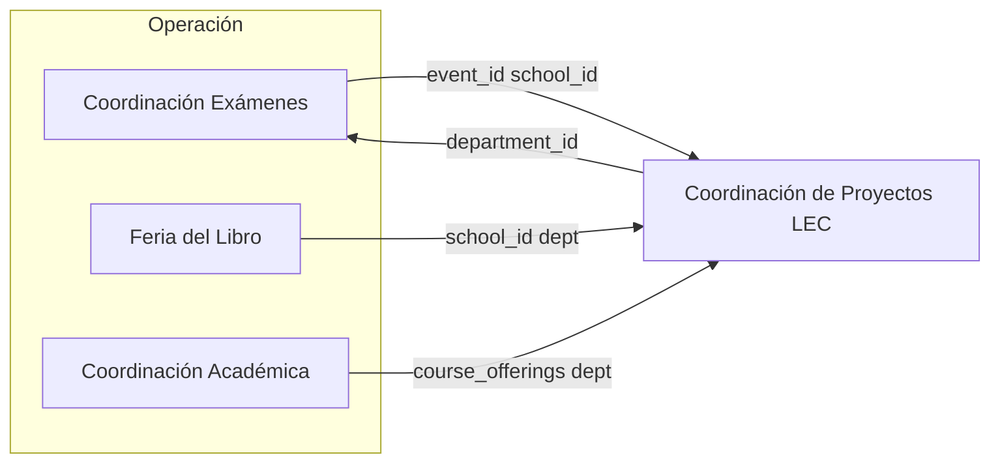

# Auditoría — Coordinaciones LEC y sidebar

Inventario **mayo 2026** del menú lateral y su alineación con los cuatro ejes de negocio. Documento canónico de producto/ingeniería; la visión ejecutiva está en [COORDINACIONES_LEC_ARQUITECTURA.md](../COORDINACIONES_LEC_ARQUITECTURA.md).

---

## 1. Resumen ejecutivo

| Eje | Cobertura actual | Brecha principal |
|-----|------------------|------------------|
| Coordinación Exámenes | ~80% | Aislamiento por sede (BC) para operadores |
| Feria del Libro | ~40% | Flujo ventas/cierre; categoría DB ≠ label UI |
| Coordinación Académica | ~30% | No es padre sidebar; dos modelos de “curso” |
| Coordinación de Proyectos | ~70% (hub) | Confusión con PM empresa y departamento homónimo |

**Recomendación:** cuatro padres en sidebar + un hub de concentrado; sede como **filtro transversal**, no como módulo duplicado.

---

## 2. Cómo se construye el sidebar

```text
module_registry (Supabase)
        ↓
GET /api/v1/modules
        ↓
member_module_access (GET /api/v1/users/me) → can_view
        ↓
sidebar-nav.tsx
  · NATIVE_ROUTES (slug → /dashboard/...)
  · canonicalSidebarCategory / categoryDisplayLabel
  · buildCoordinationExamSubgroups()
  · buildCoordinacionProyectosSubgroups()
  · CALENDARIO_SESIONES_NAV, GLOBAL_PROJECTS_GROUP (hard-coded)
```

| Archivo | Rol |
|---------|-----|
| `src/components/sidebar-nav.tsx` | Agrupación, orden A→Z, árboles especiales |
| `src/app/api/v1/modules/route.ts` | Lista módulos + filtro custom por rol |
| `public.module_registry` | Fuente de verdad: slug, name, icon, category |
| `docs/wiki/sidebar-modulos-y-agrupacion.md` | Convenciones padre/hijo |

---

## 3. Estado actual — padres nivel 1

| Label visible | Categoría DB (bucket) | Icono categoría | Notas |
|---------------|----------------------|-------------------|--------|
| Coordinación de Exámenes | `Coordinación de Exámenes` | Building2 | Árbol 2–3 niveles |
| Coordinación de proyectos | `Coordinación de proyectos` | Layers | Slug `coordinacion-proyectos-lec` |
| Feria de libro | `Logística` | Library | Rename solo en UI |
| Directorio | `Catálogos` | BookOpen | Incluye schools/applicators |
| Académico | `Académico` | GraduationCap | Solo `courses` hoy |
| Finanzas, Institucional, Comercial, Ajustes | Igual nombre | Varios | Listas planas |
| Proyectos (Empresa) | — (inyectado) | Kanban | Si `project-management` visible |
| Calendario de sesiones | — (hard-coded) | Calendar | Siempre en mezcla A→Z |

---

## 4. Inventario por coordinación

### 4.1 Coordinación Exámenes

**Slugs en subárbol** (ver `COORD_EXAM_*_SLUGS` en `sidebar-nav.tsx`):

| Subgrupo | Slugs | Ruta nativa (ejemplo) |
|----------|-------|------------------------|
| Sistema Uno | `unoi-planning`, `calculator`, `payroll`, `ih-billing` | `/dashboard/coordinacion-examenes/...` |
| TOEFL | `toefl`, `toefl-codes`, `speaking-packs` | `/dashboard/toefl/...` |
| CENNI | `cenni` | `/dashboard/cenni` |
| OOPT | `oopt-pdf` | `/dashboard/oopt-pdf` |
| IELTS | `ielts` | `/dashboard/coordinacion-examenes/ielts` |
| Otros | `events`, `event-documents`, etc. | `/dashboard/eventos`, etc. |
| PM en coordinación | `project-management` | `/dashboard/coordinacion-examenes/proyectos` (label «Proyectos (Coordinación)») |

**Alias de permisos sidebar:**

| Slug | Resuelve a |
|------|------------|
| `travel-expenses` | `finanzas` |
| `event-documents` | `documents` |

**Condensar**

| Acción | Detalle |
|--------|---------|
| Mantener | Árbol Cambridge/TOEFL/CENNI |
| Unificar entrada | CxC IH: una sola fila; filtro Sonora/BC en vista |
| Sacar visual | `schools`/`applicators` del árbol (ya en Directorio) |
| Renombrar | «Proyectos (Coordinación)» |

**Agregar**

| Ítem | Tipo |
|------|------|
| Contexto sede | Subgrupo o selector global bajo Exámenes |
| RLS por sede | APIs eventos, nómina, IH, inventario |

---

### 4.2 Feria del Libro

| Existe | Referencia |
|--------|------------|
| Módulo `inventory` | `NATIVE_ROUTES.inventory` → `/dashboard/logistica/inventario` |
| Tablas inventario | `20260510_sprint_4_courses_inventory.sql` |
| Proceso SGC | `PROC_FERIA_LIBRO` |
| Depto concentrado | Seed `Feria del Libro` en `lec_cp_departments` |

| Falta | Prioridad |
|-------|-----------|
| `category = 'Feria del Libro'` en registry | Alta (Fase 1) |
| Ventas / cierre feria | Media (Fase 4) |
| Enlace SGC ↔ inventario | Baja |

---

### 4.3 Coordinación Académica

| Pieza | Ubicación |
|-------|-----------|
| Sidebar | `Académico` → `courses` |
| API simulador | `/api/v1/courses` |
| Ofertas operativas | `lec_course_offerings` + pestaña Cursos en hub LEC |
| Proceso HR | `SUBPROC_COORD_ACADEMICA` |

| Condensar | Agregar |
|-----------|---------|
| Renombrar categoría a **Coordinación Académica** | Shell con pestañas unificadas |
| Documentar diferencia courses vs lec_course_offerings | Sync o deep links entre ambos |

---

### 4.4 Coordinación de Proyectos (hub)

| Pieza | Valor |
|-------|--------|
| Slug | `coordinacion-proyectos-lec` |
| Sidebar subgrupos | Vista general + Catálogos/Evidencias/Comparativos |
| Pestañas shell | Overview, Concentrado, Exámenes, Cursos, Importar |
| API | `/api/v1/coordinacion-proyectos/*` |

**Departamentos** (catálogo, no menú):

```text
1 Coordinación Exámenes
2 Baja California
3 Feria del Libro
4 Coordinación Académica
5 Coordinación de Proyectos
```

Ver [coordinacion-proyectos-lec.md](./coordinacion-proyectos-lec.md) para operación diaria.

**Drift check (CI):** `npm run check:sidebar-docs` — compara `sidebar-nav.tsx` con esta página (`scripts/check-coordinaciones-sidebar-drift.ts`).

---

## 5. Matriz: condensar / agregar / renombrar

| Decisión | Qué | Esfuerzo |
|----------|-----|----------|
| **Condensar** | Tres “proyectos” → glosario de 2 rutas + hub | Bajo |
| **Condensar** | Directorio único para escuelas/aplicadores | Hecho |
| **Renombrar** | `Logística` → `Feria del Libro` (registry) | Migración SQL |
| **Renombrar** | `Académico` → `Coordinación Académica` | Migración SQL |
| **Agregar** | Filtro sede + RLS | Alto |
| **Agregar** | Módulos ventas feria | Alto |
| **No hacer** | Sidebar duplicado por sede | — |
| **No hacer** | Tenant separado para BC | — |

---

## 6. Sidebar objetivo (referencia visual)

```text
Dashboard
Calendario de sesiones

▼ Coordinación Exámenes
    [Sedes: Sonora | Baja California | Todas*]
    ▼ Cambridge → Sistema Uno
    ▼ TOEFL | CENNI | OOPT | IELTS
    Eventos | Documentos | Logística sesión

▼ Feria del Libro
    Inventario | [Ventas] | [Reportes]

▼ Coordinación Académica
    Cursos | Programas | Ofertas

▼ Coordinación de Proyectos
    Overview | Concentrado | Exámenes | Cursos | …

Directorio | Finanzas | Comercial | Ajustes
Gestión de proyectos internos
```

\* *Todas* solo supervisor/admin.

---

## 7. Interconexión de datos



Tabla `lec_program_projects` — campos de enlace: `school_id`, `event_id`, `crm_opportunity_id`, `pm_project_id`, `department_id`.

---

## 8. Multisede (Baja California)

| Capa hoy | Implementación | Gap |
|----------|----------------|-----|
| Catálogo sedes | `org_locations` | OK |
| Usuario | `org_members.location` en invitación | OK |
| Aplicadores | `location_zone` | OK |
| IH Billing | Tabs Sonora / BC | UI sí; RLS no |
| APIs operativas | — | Sin filtro automático por sede |

Plan detallado: [sedes-multisede-y-aislamiento-operativo.md](./sedes-multisede-y-aislamiento-operativo.md).

---

## 9. Plan por fases

### Fase 1 — Claridad documental y copy (1–2 días)

- [ ] Glosario “proyectos” en UI y docs
- [ ] Migraciones category Feria / Académica (cuando se apruebe)
- [ ] Enlaces QuickLink hub ↔ exámenes (parcialmente hecho)

### Fase 2 — Interconexión (3–5 días)

- [ ] Deep links desde concentrado a evento, escuela, inventario, curso
- [ ] Badge sede en header si `member.location` definido
- [ ] Wiki operativa por coordinación actualizada

### Fase 3 — Seguridad sede (1–2 semanas)

- [ ] `location_id` / `region` en tablas clave
- [ ] Políticas RLS + helper en `withAuth`
- [ ] Tests E2E operador BC vs Sonora

### Fase 4 — Feria completa

- [ ] Flujo alineado a `PROC_FERIA_LIBRO`

---

## 10. Plantilla para pedir cambios al agente

```text
Coordinación: [Exámenes | Feria | Académica | Proyectos]
Tipo: [condensar | agregar | renombrar | RLS sede]
Padre sidebar (category): «___________»
Slugs afectados: ___________
¿Subgrupos colapsables?: sí / no
Rutas Next: ___________
RBAC: ___________
¿Migración module_registry?: sí / no
Fase roadmap: [1|2|3|4]
```

Convenciones completas: [sidebar-modulos-y-agrupacion.md](./sidebar-modulos-y-agrupacion.md).

---

## 11. Referencias

| Documento | Contenido |
|-----------|-----------|
| [COORDINACIONES_LEC_ARQUITECTURA.md](../COORDINACIONES_LEC_ARQUITECTURA.md) | Arquitectura canónica |
| [COORDINACION_PROYECTOS_LEC.md](../COORDINACION_PROYECTOS_LEC.md) | Hub técnico |
| [sidebar-modulos-y-agrupacion.md](./sidebar-modulos-y-agrupacion.md) | Jerarquía sidebar |
| [sidebar-navegacion-y-sistema-uno.md](./sidebar-navegacion-y-sistema-uno.md) | Sistema Uno, Feria label |
| [eventos-documentos-coordinacion.md](./eventos-documentos-coordinacion.md) | Documentos de evento |
| [sedes-multisede-y-aislamiento-operativo.md](./sedes-multisede-y-aislamiento-operativo.md) | BC y RLS |

---

Volver al **[índice wiki](./README.md)**.
